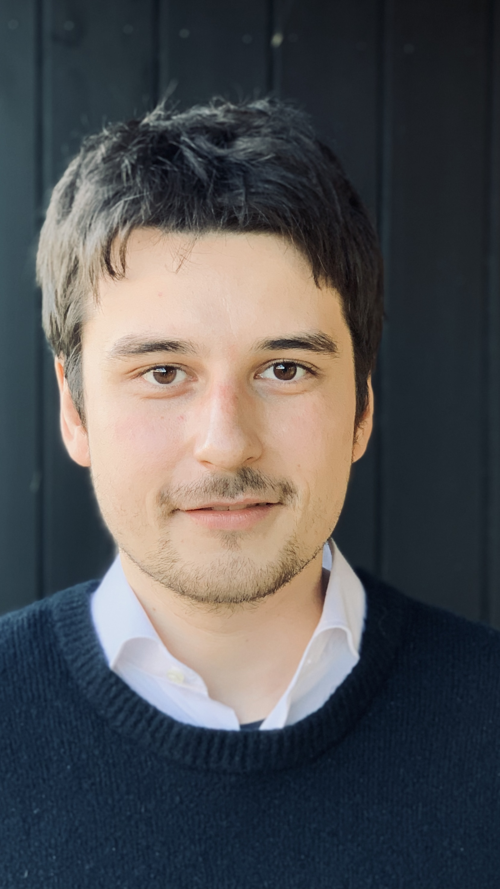

```{r, include=FALSE}
knitr::opts_chunk$set(
  results='asis', 
  echo = FALSE
)

library(magrittr) # For the pipe
source("cv_printing_functions.r")

# Read in all data and initialize a CV printer object
CV <- create_CV_object(
  data_location = "https://docs.google.com/spreadsheets/d/1yurMjDRly4vgXue8GJKc0FlQW00lPbIalm4p7K_srrY/edit?usp=sharing",  
  pdf_mode = params$pdf_mode
)

```


```{r}
# When in pdf export mode the little dots are unaligned, so fix that with some conditional CSS.
if(params$pdf_mode) {
    cat("
<style>
:root{
  --decorator-outer-offset-left: -6.5px;
}
</style>")
}
```


Aside
================================================================================



```{r}
if(params$pdf_mode){
  cat("")
} else {
  cat("[<i class='fas fa-download'></i> Download a PDF of this CV](https://github.com/emilmalta/cv/raw/main/cv.pdf)")
}
```

```{r}
if(params$pdf_mode){
  cat("")
} else {
  cat("[<i class='fas fa-download'></i> Download a PDF of this CV](https://github.com/emilmalta/cv/raw/main/cv.pdf)")
}
```


Contact {#contact}
--------------------------------------------------------------------------------


```{r}
CV %>% print_contact_info()
```

Languages {#languages}
--------------------------------------------------------------------------------

Danish (Native Speaker) <br>
English (Strong)<br>
Greenlandic (Native Speaker)

Programming {#skills}
--------------------------------------------------------------------------------

```{r}
CV %>% print_skill_bars()
```

Main
================================================================================

Emil Nikki Malta {#title}
--------------------------------------------------------------------------------

```{r}
# Note the special double pipe so we modify the CV object in place
CV %<>% print_text_block("intro") 
```

Experience {data-icon=laptop}
--------------------------------------------------------------------------------

```{r}
CV %>% print_section("experience")
```

Education {data-icon=graduation-cap data-concise=true}
--------------------------------------------------------------------------------

```{r}
CV %<>% print_section('education')
```


</div>

<br>

::: {#title}
::: {.section .level1}

<h1>Key Skills</h1>

**Statistical programming**
SAS (Advanced), R (expert), SQL (near expert), Python (intermediate).

**Statistical modeling**
Regression models (logistic, ridge, LASSO etc.), Survival Analysis, Classification trees, Bootstrapping, PCA, Clustering, SVMs, etc.

**Data Management**
Large-scale databases, national statistics, healthcare registers.

**Data Visualisation**
ggplot2 (expert), Tableau (expert), Plotly (intermediate), Seaborn (intermediate)

**Domain knowledge**
Genetic epidemiology, sustainability in healthcare, bioinformatics.


<h1>

Personal

</h1>

Part of my free time is spent playing guitar and piano. I run 4 times a week, and am currently training for a
half-marathon.

You will know me as an extrovert colleague, who values good relations. Very good at sharing knowledge and experience. Good at managing own
tasks.

I am 35 years old, living in Mørke on Djursland. Born and raised in
Greenland. Married to Astrid Helena, with whom I have 2 kids. On paternity leave at the time of writing, until end of January.

:::
:::
